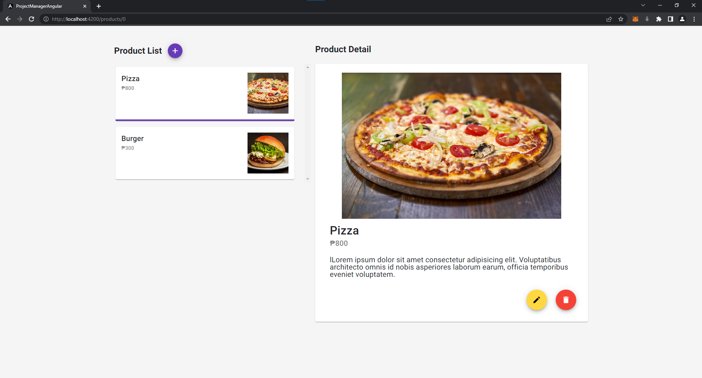

# Project Manager - Angular

A simple angular project where it displays a list of products and access the detailed information of the product selected. Additionally, users can add, edit, and delete a product.

Live Demo: https://angular-project-manager.vercel.app/



## Technologies Used

- Node.js
- Angular
- Angular Material
- Bootstrap

## Development Setup

### Prerequisites

- Node.js
- Angular CLI

### Setup Project

1. Clone the repository and navigate to the project directory
2. Install dependencies

```
npm install
```

3. Run the project

```
ng serve
```

4. Navigate to `http://localhost:4200/`
